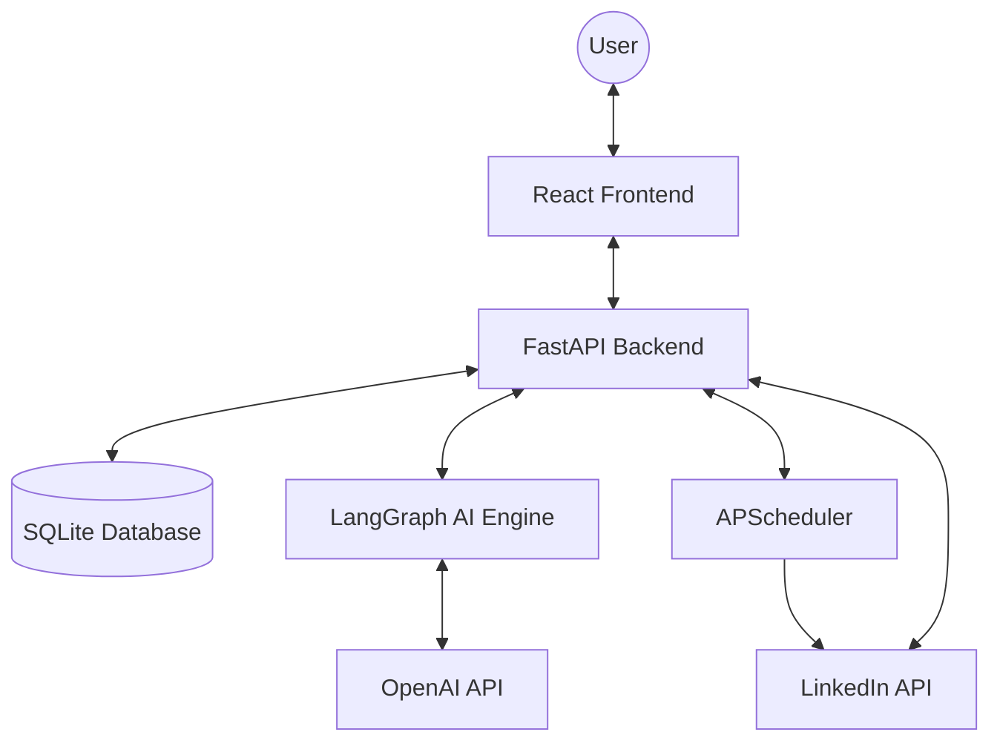

# System Architecture

LinkedAI is built with a decoupled architecture, separating the AI reasoning engine, the scheduling service, and the user interface.

## 1. High-Level Overview

## 2. Component Details

### Backend (FastAPI)
- **API Layer**: Handles authentication, user management, and communication with the frontend.
- **Service Layer**: Contains the business logic for LinkedIn OAuth, post generation, and analytics fetching.
- **Data Layer**: SQLAlchemy models for Users, Posts, and Analytics data.

### AI Engine (LangGraph & LangChain)
- **Content Discovery**: Scrapes and analyzes external news URLs or topics.
- **Post Generation Node**: Uses custom prompts to transform raw information into LinkedIn-optimized content.
- **Review Node**: Validates the generated content against LinkedIn best practices (hashtags, length, formatting).

### Scheduler (APScheduler)
- A background process that polls the database for scheduled posts and executes them via the LinkedIn API at the designated times.

### Frontend (React + Vite)
- **Dashboard**: A unified interface for all automation tasks.
- **State Management**: Uses React Context for authentication and local state for UI components.
- **Design System**: A custom CSS-in-JS and Vanilla CSS hybrid focused on performance and premium aesthetics.

## 3. Data Flow: Post Generation
1. User submits a topic or URL via the Frontend.
2. Backend triggers the LangGraph pipeline.
3. LangGraph scrapes content (if URL) and generates a post draft.
4. Draft is returned to the user for review.
5. Once approved/scheduled, the Backend saves it to the DB and notifies the Scheduler.
